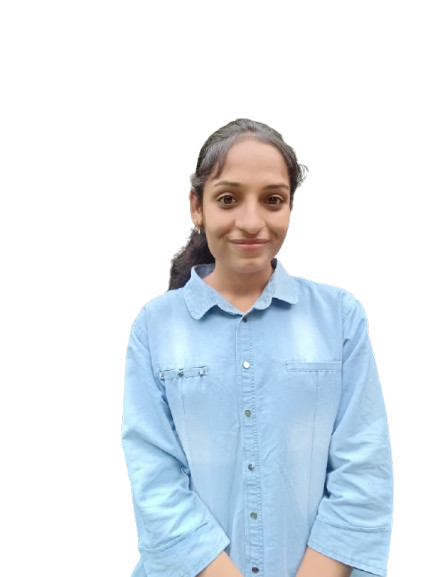

<div align="center">
  
  
  <h1>🚀 Portfolio Website</h1>
  <p>A modern, responsive portfolio built with <b>Next.js</b> & <b>TypeScript</b></p>
  
  <p>
	 
	 
	 
	 
  </p>
</div>

---

## ✨ Features

🌟 **Next.js 14** — Fast, server-side rendered React framework  
🔒 **TypeScript** — Type-safe codebase for reliability  
🧩 **Modular Components** — Reusable UI for easy maintenance  
📂 **Project Showcase** — Dynamic project pages with images and details  
📬 **Contact Form** — Simple contact form for inquiries  
📱 **Responsive Design** — Mobile-friendly and accessible  
🎨 **Custom Styling** — Uses PostCSS and custom CSS  

---

## 📁 Folder Structure

```text
portfolio/
├── app/
│   ├── About/
│   ├── ProjectPage/[id]/
│   ├── context/
│   ├── favicon.ico
│   ├── globals.css
│   ├── layout.tsx
│   └── page.tsx
├── components/
│   ├── ui/
│   ├── Completion.tsx
│   ├── ContactForm.tsx
│   ├── Footer.tsx
│   ├── Hero.tsx
│   ├── HeroSection.tsx
│   ├── Navbar.tsx
│   ├── Project.tsx
│   └── Tech.tsx
├── lib/
│   └── utils.ts
├── public/
│   └── [assets]
├── package.json
├── tsconfig.json
├── next.config.ts
├── postcss.config.mjs
├── eslint.config.mjs
└── README.md
```

---

## 🛠️ Getting Started

1. **Install dependencies:**
	```bash
	npm install
	```
2. **Run the development server:**
	```bash
	npm run dev
	```
3. **Open your browser:**
	Visit [http://localhost:3000](http://localhost:3000)

---

## 📜 Scripts

- `npm run dev` — Start development server
- `npm run build` — Build for production
- `npm run start` — Start production server
- `npm run lint` — Lint code

---

## 🎯 Customization

- Add your projects in the `components/Project.tsx` or relevant data files.
- Update personal info and skills in `HeroSection.tsx`, `Tech.tsx`, and `About/page.tsx`.
- Replace images and assets in the `public/` folder.

---

## 📬 Contact

For questions, suggestions, or collaborations, feel free to open an issue or reach out via the contact form on the website!

---

## 📝 License

This project is open source and available under the [MIT License](LICENSE).
